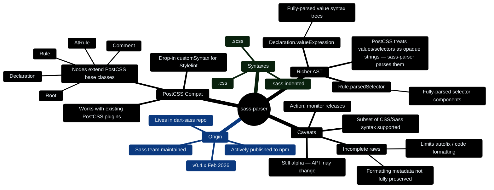

# CLAUDE.md

This file provides guidance to Claude Code (claude.ai/code)
when working with code in this repository.

## Implementation Plan

The full implementation plan lives in `docs/plan/`:

- `docs/plan/00-desired-state.md` -- Installation, configuration,
  CLI usage, recommended config contents
- `docs/plan/01-architecture.md` -- Package structure, rule pattern,
  test pattern, plugin entry point
- `docs/plan/02-roadmap.md` -- 8-phase roadmap (Phase 0-7 + future),
  dependency graph, exit criteria per phase
- `docs/plan/rules/` -- 18 rule specification files,
  each with BAD/GOOD `.sass` test cases

Development is designed for **autonomous agentic execution**:
each phase has clear entry/exit criteria. Human feedback is only
needed at explicit phase gates marked in the roadmap.

## Project Overview

This is a **new Sass indented syntax (`.sass`) linter** -- a
greenfield project to fill the gap left by the abandoned
[sasstools/sass-lint](https://github.com/sasstools/sass-lint)
(archived March 2022). No maintained linter exists today for
`.sass` files.

### Why This Project Exists

- `sasstools/sass-lint` is archived; its parser (gonzales-pe)
  is unmaintained and can't parse modern Sass
  (`@use`, `@forward`, CSS custom properties).
- Stylelint + `postcss-sass` is unreliable for `.sass`:
  postcss-sass wraps gonzales-pe, inherits its bugs, and
  hasn't been published in 5+ years. Autofix causes
  destructive bugs (mixins disappearing).
- The official Sass team still invests in indented syntax
  (Dart Sass 1.80+ added multiline statements, flexible
  line breaks, optional semicolons for `.sass`).
- There is no tree-sitter grammar for `.sass` either.

## Architecture Strategy

### Parser: sass-parser (official)

The project should be built on
**[sass-parser](https://www.npmjs.com/package/sass-parser)**
(`pkg/sass-parser` inside the dart-sass repo):

- Built by the Sass team, actively developed
  (v0.4.x as of Feb 2026)
- PostCSS-compatible AST -- statement nodes extend PostCSS's
  `Rule`, `AtRule`, `Declaration`, `Comment`, `Root`
- Natively supports `.sass`, `.scss`, and `.css`
  via `Syntax` exports
- Provides richer AST than plain PostCSS:
  `Declaration.valueExpression` gives fully-parsed value
  trees, `Rule.parsedSelector` gives fully-parsed selectors
- **Caveat**: still alpha, incomplete "raws" (formatting
  metadata), subset of CSS/Sass syntax supported.
  Monitor releases.

#### sass-parser Mind Map

<!-- markdownlint-disable MD013 -->

<!-- markdownlint-enable MD013 -->

### Two Viable Paths

<!-- markdownlint-disable MD013 MD060 -->

| Path                  | Description                                                                                                 | Tradeoff                                                                                               |
| --------------------- | ----------------------------------------------------------------------------------------------------------- | ------------------------------------------------------------------------------------------------------ |
| **Stylelint plugin**  | Use sass-parser as `customSyntax` for Stylelint, write `.sass`-specific rules as a Stylelint plugin package | Inherits 168 core rules + ecosystem; depends on Stylelint release cycle and sass-parser PostCSS compat |
| **Standalone linter** | Build a standalone CLI that uses sass-parser directly, with its own rule engine                             | Full control; more work; must implement rule engine, config loading, reporter, CLI                     |

<!-- markdownlint-enable MD013 MD060 -->

The Stylelint plugin path is recommended as the primary
strategy. A standalone linter could be a fallback if
sass-parser's PostCSS compatibility proves insufficient.

### Lessons from sasstools/sass-lint's Failure

1. **Don't own the parser** -- sasstools/sass-lint died
   because gonzales-pe died. Depend on the official
   sass-parser maintained by the Sass team.
2. **Support custom/plugin rules** -- sass-lint's lack of
   extensibility (issue #1046) limited community
   contribution.
3. **Autofix must be careful** -- postcss-sass's autofix
   destroyed code. Any autofix for indentation-sensitive
   syntax needs extensive snapshot testing.
4. **Keep up with Sass evolution** --
   `@use`/`@forward` module system, new indented syntax
   features (Dart Sass 1.80+) must be supported from
   day one.

## Key Reference Projects

<!-- markdownlint-disable MD013 MD060 -->

| Project             | Role                                                             | URL                                                           |
| ------------------- | ---------------------------------------------------------------- | ------------------------------------------------------------- |
| sass-parser         | Parser (official, PostCSS-compatible)                            | `npm: sass-parser` / `github: sass/dart-sass/pkg/sass-parser` |
| Stylelint           | Potential host framework for rules                               | `github: stylelint/stylelint`                                 |
| sasstools/sass-lint | Historical reference for rule implementations (78 rules)         | `github: sasstools/sass-lint` (archived)                      |
| sass/linter         | Dart-based experiment by Sass team (archived 2019, 2 rules only) | `github: sass/linter`                                         |
| gonzales-pe         | Legacy parser -- do NOT use                                      | `github: tonyganch/gonzales-pe`                               |
| postcss-sass        | Legacy PostCSS wrapper -- do NOT use                             | `github: AleshaOleg/postcss-sass`                             |

<!-- markdownlint-enable MD013 MD060 -->

## MVP Rule Set (~25-30 rules)

Priority rules for initial release, grouped by category:

**Error prevention**: `no-duplicate-properties`,
`no-invalid-hex`, `no-empty-rulesets`,
`no-misspelled-properties`, `no-unknown-at-rules`,
`no-duplicate-selectors`, `declaration-no-important`,
`no-descending-specificity`

**Naming conventions**: `class-name-format`,
`id-name-format`, `mixin-name-format`,
`variable-name-format`, `placeholder-name-format`

**Best practices**: `nesting-depth`, `no-color-literals`,
`no-ids`, `no-qualifying-elements`, `shorthand-values`,
`no-vendor-prefixes`, `property-sort-order`

**Indented-syntax specific**: `indentation`,
`no-trailing-whitespace`, `empty-line-between-blocks`,
`single-line-per-selector`, `final-newline`

**Sass-specific**: `extends-before-declarations`,
`mixins-before-declarations`,
`declarations-before-nesting`,
`placeholder-in-extend`, `no-debug`

## Indented Syntax Parsing Challenges

These are the core technical difficulties that killed
previous projects -- any implementation must handle them:

- **Whitespace-significant grammar**: indentation replaces
  `{}`, newlines replace `;` -- the parser must track
  indent levels and context-dependent statement boundaries
- **Shorthand syntax**: `=` for `@mixin`, `+` for
  `@include` -- unique to `.sass`, not in SCSS
- **Multiline statements**: lines can continue if breaks
  occur inside parentheses or between keywords in
  `@`-rules
- **Sass 1.80+ additions**: optional semicolons, inline
  SCSS formatting in `.sass` files, flexible line
  breaks -- the new "relaxed" indented syntax must be
  supported
- **Interpolation**: `#{}` inside selectors, property
  names, and values requires special parsing
